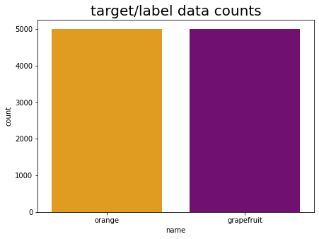
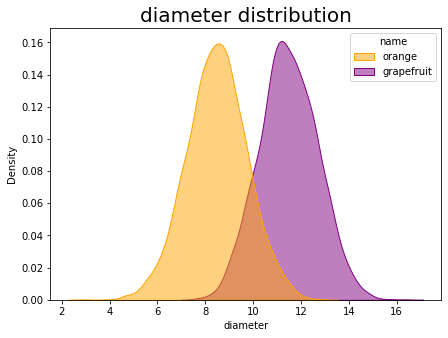
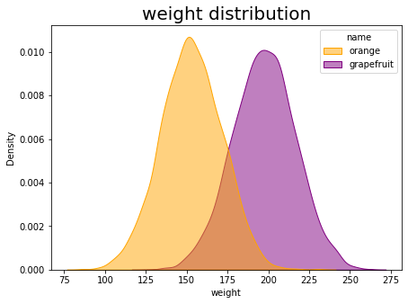
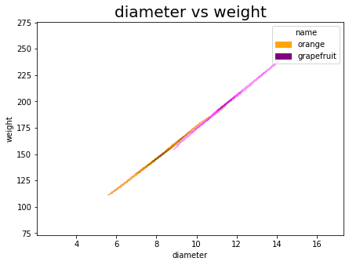
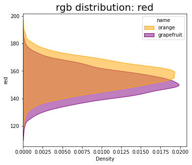
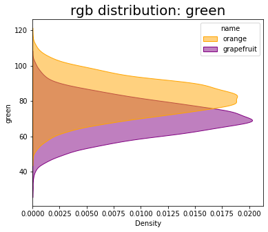
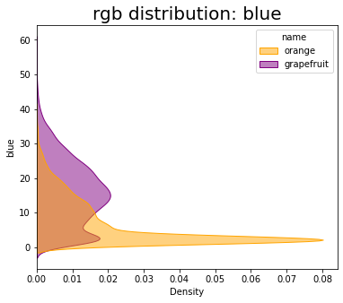
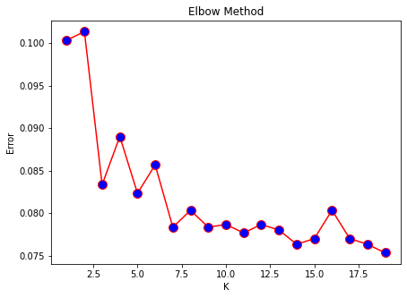

# ORANGE VS GRAPE
fun and simple Machine Learning exercise to build classifier model for citrus data (orange vs grape)

#
### NOTEBOOK
view full code on jupyter notebook [*here*]()

#

### THE DATASET
dataset uploaded by Josh on kaggle: https://www.kaggle.com/joshmcadams/oranges-vs-grapefruit which he mentioned was fictional dataset.

#

### Objective
to classify orange and grapefruit.

#

## TABLE OF CONTENT
- EDA
- MODEL COMPARISION

#

# EDA

Dataset consisted of 10000 data with 6 feature:
- name      target column (orange or grapefruit)
- diameter  diameter of fruit
- weight    weight of fruit
- red       value of red on rgb colorscale  
- green     value of green on rgb colorscale
- blue      value of blue on rgb colorscale  

 

Target/name distribution:

 
 

diameter distribution:

 
 

weight distribution:

 
 

diameter vs weight

 
 

rgb value distribution:

#

# MODEL COMPARASION
The model was trained with train vs test data ratio of 70% train and 30% test.

Model build with several classifier:
1. Logistic Regression
2. Decision Tree
3. SVM
4. KNN
5. XG Boost
6. Random Forest

For KNN. i select K with iterating k from 2-20: 

i choose k = 9 and 116

## MODEL COMPARASION:

                    model       acc
    5             XG Boost  0.985667
    6        Random Forest  0.945667
    2                  SVM  0.931000
    0  Logistic Regression  0.924333
    1        Decision Tree  0.923000
    3             KNN, k=9  0.921667
    4            KNN, k=16  0.919667

> accuracy ranged from 91.9% to 98.5%